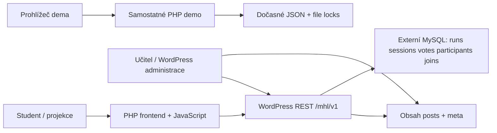

# Architektura

**Aktualizace 2026-10-02 pro 0.8.7:** opravný rozsah původního 0.9.0-dev.1 prošel také 19 integračními kontrolami na WordPressu 7.1.2/MariaDB 11.4.9. Oba SQL exporty byly obnoveny a tabulky zkontrolovány lokálně. Původní body níže označené „dosud neověřeno“ zachycují stav před touto kvalifikací; aktuální souhrn je v RELEASE-0.8.7.md. Nasazení prokazuje samostatná deployment zpráva.

Frontend nevykresluje obsah z databáze přímo. Prohlížeč se periodicky ptá na aktivní otázku a výsledky. WordPress obsah definuje předměty, přednášky, otázky, odpovědi, správnost, časové limity a metadata vyučujících. Externí DB uchovává provozní relace, hlasy a pseudonymní účastníky. Je potřeba zálohovat obě DB koordinovaně.

V 0.8.7 otevření studentského odkazu čte stav a případně zaznamená připojení; nespouští live/test otázku. Řízení vyžaduje stávající WordPress `manage_options` a WordPress nonce/auth mechanismus. Tato role je přechodná, nikoli hotový multi-teacher model. Stav `joining` ze starších verzí se neotevře sám, učitel ho může otevřít v panelu.

Režim `async` nadále znamená existující dlouhodobou anketu povolenou učitelem. Není přejmenován na plnohodnotný domácí úkol. Domácí úkol potřebuje vlastní zadání, termín, pokusy, řízení zpětné vazby a vazbu na obsah otázky/sady.

Stávající trvalé slugy a `/q/...`, `/r/...`, `/test/...`, `/poll/...` jsou zachovány. Budoucí náhodný `/join/{code}` musí fungovat jako další vrstva identifikace se zachováním všech starých odkazů.

Demo používá jednu serverovou časovou osu, zámek pro každý JSON soubor, náhodné identifikátory a 17 označených syntetických účastníků. Souhlas se zveřejněním je individuální; veřejný payload nesmí obsahovat skryté přezdívky. Fyzické mazání expirovaných souborů závisí na dalším požadavku; pravidelný úklid je budoucí provozní úkol.
